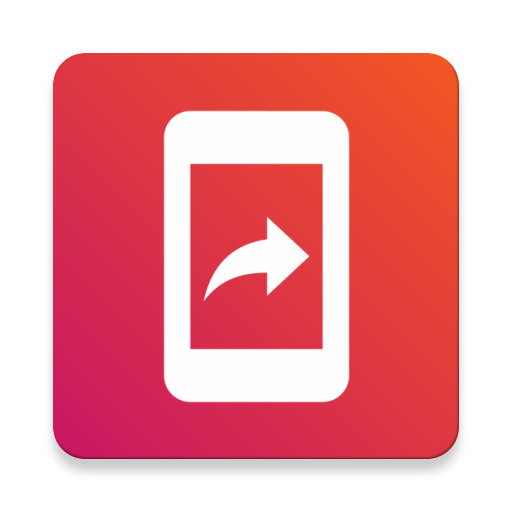

     

<h3 align="center">Screenshot assistant</h3>

## Table of Contents
- [See it in action](#see-it-in-action)
- [Setup Guide](#setup-guide)
- [Features](#features)
- [Credits:](#credits)

## See it in action

## Setup Guide

1. Install the app
2. Set it as assistant via `Apps` > `Default Apps` > `Assist app`
3. Trigger assistant, crop and share

## Features

- Screenshot in 100% JPEG-Quality
- Tight system integration via Assist API
- No permission needed

## Credits

- Original [Screenshot Assistant](https://play.google.com/store/apps/details?id=pl.waskysoft.screenshotassistant) - *Unfortunately not open source*
- [Android Image Cropper](https://github.com/ArthurHub/Android-Image-Cropper)
- [Material About Library](https://github.com/daniel-stoneuk/material-about-library)
